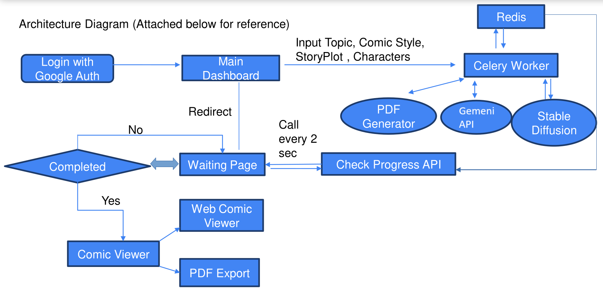

<h1 align="center">StoryScape</h1>
<p align="center">
    <a href="https://python.org">
    
  </a>
  <a href="https://flask.palletsprojects.com/">
    
  </a>
  <a href="https://jupyter.org/">
    
  </a>
  <a href="https://huggingface.co/">
    
  </a>
  <a href="https://github.com/priyadarshiindia/StoryScape">
    
  </a>
</p>

<p align="center">
  StoryScape is GenAI powered Interactive Storyteller platform, which will convert boring textual
content or taboo topics to visually appealing comics/manga.
</p>

# Demonstration of the Project

- Click on this below image for playing video

[](https://youtu.be/Vkc4uf2bx9c)

## Problem Statement
- Nowadays students face problem due to `low attention span` which is less than a gold fish.
    - Gold fish attention span: `9 sec`
    - Humans attention span: `8 sec`

- Also, It is `very hard to spread awareness` about topics which are considered
`“taboo”` in our society such as `periods`, `superstations`, `sex education`, etc.

- As per studies conducted in `US by NCBI`, suggested that approx. `65%` of the
population are `visual learners`, So learning from textual content leads to
    - Difficulty in Conceptualization
    - Reduced Retention
    - Limited Engagement
    - Difficulty in Problem-Solving
    - Limited Creativity and Expression
    - Increased Cognitive Load

## Our Solution
- Our idea is to build Gen AI powered platform, which will `convert boring textual content or taboo topics` to visually appealing `comics/manga`.

- User can `specify plot` & `characters` of the storyline `or just enter a topic` and it will generate a comic book as per their `comic style` i.e. `Marvel`, `DC`, `Disney Princess`, `Anime` etc.

- Our platform will utilize `text-to-image transformations` using `Stable
Diffusion`.

- We will optimize the pipeline to `generate a comic under 30-50 secs` using `Multithreading` & `Caching database (Redis)`.

## Features Offered
- [X] Generate in your favourite comic style i.e. Marvel, DC, etc
- [X] Ability to set custom characters and story plot
- [X] Generate Shareable comic link or share comic pdf
- [X] Enhances user experience with realistic animations simulating page turning
and book opening/closing, creating an immersive digital reading
environment.
- [X] Ability to create vernacular(Hindi/English/Tamil/etc) comics

## Sample Comics Generated By Our Platform
1. [Dragon Tale](/static/pdfs/dragon_tale.pdf)
2. [Vampire Story](/static/pdfs/vampire_story.pdf)
3. [Naturo preparing for exam](/static/pdfs/naruto_preparing_for_exams_.pdf)

# StoryScape : Two Models

 1. [Comics-Dialogue-Generator 📝](#Comics-Dialogue-Generator)
 5. [Comics-Scenes-Generator 💬🤖](#Comics-Scenes-Generator)

<a name="Comics-Dialogue-Generator"></a>
## Comics-Dialogue-Generator 📝

- This code snippet demonstrates the utilization of Google GemeniAPI for generating comic dialogues
- Facilitating the generation of comic dialogues based on textual prompts. 
- For Creating High quality comic scene images, we are Generating dynamic image prompts for specifying minute details about the comic scenes, these dynamic image prompts are created using gemeni by supplying comic scene dialogue.
- By using the model gemeni api along with our custom post processing code, the script efficiently processes the input prompt and produces comic dialogues in a Json format. 

>Prompt : Funny Cindralla story in Disney Princes style

**Notebook Link** : [Click Here](https://github.com/priyadarshiindia/StoryScape/blob/main/ComicDialogueGenerator/GenerateComicDialogueAPI.ipynb)

<a name="Comics-Scenes-Generator"></a>
## Comics-Scenes-Generator 👤🚀

- This code implements an image generation model using Stable Diffusion optimised by IPEX and Intel OpenAPI run on Google Collab. 
- The model is designed to generate visually appealing comic scenes. 
- The Google Collab with gradio helped in reducing the time of inference, and the optimized PyTorch for Intel Hardwares helped us in reducing the overall time for comic scene generation. 🌐🖼️🤖💪

[IPEX Optimised Stable Diffusion](https://github.com/priyadarshiindia/StoryScape/blob/main/ComicSceneGenerator/ipex_stable_diffusion.ipynb) | [Normal Stable Diffusion](https://github.com/priyadarshiindia/StoryScape/blob/main/ComicSceneGenerator/normal_stable_diffusion_comparison.ipynb)

# Flow Diagram 🔄📊

1. User will login with **google auth** & will get redirected to main dashboard.
2. User will enter **Topic**(required), **Comic style**(optional), **Story plot**(optional) & **Characters** (optional).
3. After hitting enter, web application will run a **celery worker for generating a comic**
4. User will be **redirected to waiting page** where he will **get info** about the **progress**.
5. Once comic is generated, user will be **redirected to comic viewer**
6. Comic viewer will have **options** to **download** the **comic** in **pdf format** or **share** the **web comic viewer link**.

## Architecture Diagram



# Technologies Used 🛠️    
1.  **Backend - Flask:** Our application's backend was constructed using Flask, a versatile Python web framework. Flask facilitated the development of RESTful APIs, user authentication, data processing, and integration with machine learning models efficiently and swiftly. 🐍🚀
    
2.  **Other Technologies:** In addition to React, Flask, and machine learning models, our application utilizes a range of other technologies to enhance performance, security, and user experience. These include:

    -   **Celery:** Comic Generation usually takes more than 30 secs, which can leads to 502 Gateway error, so we've implemented Celery Worker by which the comic generation pipeline will be executed on server.
    -   **Redis** It is used as Broker & Caching Database to boost the performance & also used in developing flask api for showing comic progress on fronted (Loading Page)
    -   **Google Collab & Gradio:** Leveraging Google Collab's high-performance GPU capabilities, we accelerated model training and inference processes, reducing processing time and improving overall performance. ⚡💻

# How We Built It 🛠️👷‍♂️

 - User inputs a topic with story plot
 - The `Input Text` is then given to `Google gemeni api` 
 - `Raw Comic Dialogues Text` is then parsed using `Post Processing functions` which `returns` the `result` in `JSON Format`
 - `For Generating Comic Poster`, a Dynamic Image Generation prompt is generated using Neural Chat by supplying comic topic.
 - `Dynamic Image prompt` is then `given to Image Generation Model` (Intel Optimized Stable Diffusion)
 - Similarly for generating comic scenes, a dynamic image prompt is generated using gemeni by supplying Comic Scene Dialogue
 - Then that dynamically generated prompt is used to generate Comic scenes using Stable Diffusion
 - `Multithreading` is used for `parallel image & text generation`
 - Once Comic Images are generated, we `write` the `text on top of image` using `OpenCV` in `comic font`
 - Then Finally we merge the images using custom `Image List to PDF generator` code
 - `Celery worker` runs the above task & updates the `Redis db` for `saving` the `progress`
 - We have created a `Flask-Restful api` which is connected to redis for `fetching the progress`
 - `Loading page` calls this api `every 2 seconds` and shows the `progress` on the page
 - Onces the `api status is completed`, the page automatically `loads` the `Comic viewer`
 - `Comic viewer` has the functionality to either `read the comic on website itself` using `realistic page turn animation` & providing immersive comic reading experience
 - Also at the end of comic page, there is a option to `download` the `comic in PDF format`

## Installation
```
# Install Redis
sudo apt install redis-server nginx python3-pip -y
sudo systemctl start redis-server
sudo systemctl enable redis-server
sudo service redis-server status 

# Install VirtualEnv
pip3 install virtualenv

# Clone Project
git clone https://github.com/priyadarshiindia/StoryScape.git

# Navigate to folder
cd StoryScape

# Create Virtual Environment
virtualenv venv

# Activate Virtual Env.
source venv/bin/activate

# Install Requirements
pip install -r requirements.txt
```

## Run in Terminal - 1
```
python app.py
```

## Run in Terminal - 2
```
celery -A app.celery worker --loglevel=info
```
